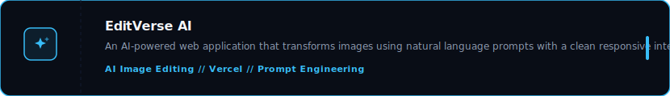

<!--
================================================================================
PREMIUM GITHUB PROFILE README (BLUE + WHITE + DARK THEME)
Handcrafted by Antigravity (Google DeepMind)
================================================================================
Color Palette Reference:
- Dark Base: #090D16 (Deep Obsidian Blue)
- Light Neutral: #F4F6F8 (Warm White)
- Primary Accent: #2A64F6 (Electric Slate Blue)
- Secondary Accent: #38BDF8 (Sky Blue)
- Secondary Text: #8E9BB0 (Slate Gray)
================================================================================
-->

  <!-- Hero Banner SVG -->
  

 

  <!-- Custom Navigation Buttons -->
  &nbsp;
  &nbsp;
  &nbsp;
  &nbsp;
  

 

### INTRODUCTION

I am a Computer Engineering student passionate about building scalable full-stack applications, intuitive user experiences, and impactful student communities. I enjoy transforming ideas into real products using modern technologies while continuously learning new tools and frameworks. Alongside development, I actively mentor students, organize technical initiatives, and contribute to engineering communities.

 

### ABOUT ME

<table width="100%">
  <tr>
    <td width="33%" valign="top">
      <h4>Current Focus</h4>
      <ul>
        <li>Building Full Stack Applications</li>
        <li>Learning scalable backend architecture</li>
        <li>Exploring AI integrations</li>
        <li>UI/UX Design</li>
        <li>Open Source</li>
      </ul>
    </td>
    <td width="33%" valign="top">
      <h4>Currently Learning</h4>
      <ul>
        <li>Advanced React</li>
        <li>System Design</li>
        <li>DevOps</li>
        <li>Cloud Deployment</li>
      </ul>
    </td>
    <td width="33%" valign="top">
      <h4>Looking For</h4>
      <ul>
        <li>Open Source Collaboration</li>
        <li>Internship Opportunities</li>
        <li>Hackathons</li>
        <li>Exciting Projects</li>
      </ul>
    </td>
  </tr>
</table>

 

| Dimension | Value |
| :--- | :--- |
| **Location** | Thane, Maharashtra, India |
| **Email** | [muthusamthevar@gmail.com](mailto:muthusamthevar@gmail.com) |
| **Portfolio** | *[Portfolio Site Coming Soon]* |

 

### TECH STACK

  <table width="100%">
    <tr>
      <td width="20%"><b>Languages</b></td>
      <td></td>
    </tr>
    <tr>
      <td><b>Frontend</b></td>
      <td></td>
    </tr>
    <tr>
      <td><b>Backend</b></td>
      <td> &nbsp; <i>REST APIs</i></td>
    </tr>
    <tr>
      <td><b>Database</b></td>
      <td></td>
    </tr>
    <tr>
      <td><b>Tools</b></td>
      <td></td>
    </tr>
    <tr>
      <td><b>Learning</b></td>
      <td> &nbsp; <i>System Design</i></td>
    </tr>
  </table>

 

### FEATURED PROJECTS

  <!-- Project 1 -->
  
  

    <a href="https://github.com/muthusam-mvt/smart-campus-connect">Repository</a> &nbsp;//&nbsp; 
    <a href="https://github.com/muthusam-mvt/smart-campus-connect">Live Demo</a>
  

   

  <!-- Project 2 -->
  
  

    <a href="https://github.com/muthusam-mvt/editverse-ai">Repository</a> &nbsp;//&nbsp; 
    <a href="https://editverse-ai.vercel.app">Live Demo</a>
  

   

  <!-- Project 3 -->
  
  

    <a href="https://github.com/muthusam-mvt/image-editing-desktop-app">Repository</a> &nbsp;//&nbsp; 
    <a href="https://github.com/muthusam-mvt/image-editing-desktop-app">Live Demo</a>
  

 

### LEADERSHIP

  <!-- Leadership Timeline SVG -->
  

 

### ACHIEVEMENTS

  <!-- Achievement Cards Row -->
  
  
  

 

### DASHBOARD STATS

  <!-- Custom Styled GitHub Stats Widgets (Blue/White/Dark Theme) -->
  <table width="100%">
    <tr>
      <td width="50%" align="center">
        
      </td>
      <td width="50%" align="center">
        
      </td>
    </tr>
    <tr>
      <td colspan="2" align="center">
         
        
      </td>
    </tr>
    <tr>
      <td colspan="2" align="center">
         
        
      </td>
    </tr>
    <tr>
      <td colspan="2" align="center">
         
        
      </td>
    </tr>
  </table>

 

<!-- Spotify Widget Placeholder (Commented Out)

  <h3>Now Playing</h3>
  

 

-->

### CONNECT

  <!-- Connect Cards Row -->
  
  
  
  

 

### FOOTER

  
Thanks for visiting.

  
<b>Let's build something amazing together.</b>

  
   
  
  <!-- Steve Jobs Quote (Premium static quote block instead of slow/unstable APIs) -->
  <blockquote>
    "Design is not just what it looks like and feels like. Design is how it works."
  </blockquote>
  
   

  <!-- Visitor Counter badge using Theme colors -->
  
  
    

  <!-- Contribution Snake (Generated via github action output) -->
  

 

<!--
================================================================================
CONTRIBUTION SNAKE AUTOMATION GUIDE
================================================================================
To animate the Contribution Snake shown above, add this workflow to your repo:
File Path: .github/workflows/snake.yml

name: Generate Snake Game

on:
  schedule:
    - cron: "0 */12 * * *" # Runs every 12 hours
  workflow_dispatch:
  push:
    branches:
    - main

jobs:
  generate:
    permissions:
      contents: write
    runs-on: ubuntu-latest
    timeout-minutes: 5
    
    steps:
      - name: Generate github-contribution-grid-snake.svg
        uses: Platane/snk/svg-only@v3
        with:
          github_user_name: ${{ github.repository_owner }}
          outputs: |
            dist/github-contribution-grid-snake.svg
            dist/github-contribution-grid-snake-dark.svg?palette=github-dark
          
      - name: Push github-contribution-grid-snake.svg to output branch
        uses: crazy-max/ghaction-github-pages@v3.1.0
        with:
          target_branch: output
          build_dir: dist
        env:
          GITHUB_TOKEN: ${{ secrets.GITHUB_TOKEN }}
================================================================================
-->
